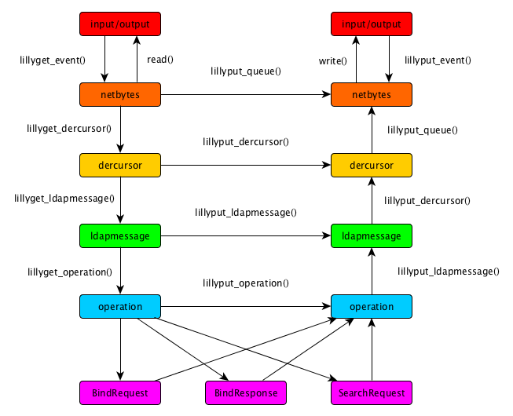
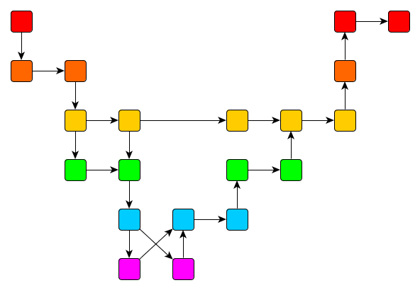

# Using LillyDAP

> *LillyDAP is a highly efficient parser/packer stack for LDAP.  It is meant
> for dynamic data handlers and middleware that manipulates queries on their
> way through.  If you need flexibility in your LDAP solution, and it needs
> a bit of custom coding, LillyDAP is probably your best bet.*

There is a standard sequence of parsing/packing stages, and you can intervene
between any of them to take control of the data passing through.  You may
block, generate, redirect, fork and join as you please.  The entire structure
works through event-styled callbacks, and connectivity to remote peers can
be easily integrated with an event loop.

The parser and, mirrorred to it, the packer for LillyDAP turn to their work
in a number of stages.  Parser routines link downwards and have names like
`lillyget_xxx()` whereas packer routines link upwards and have names like
`lillyput_xxx()`.



The levels between the operations are good to understand, so as to get the
control that you might desire over the LDAP passing through:

  * The **event** interface is meant for reporting an event worthy of the
    API; this might be an ability to read or to write.
  * The **netbytes** level processes a sequence of bytes and collects
    complete DER messages.  As soon as one is found, it is passed on.
  * The **dercursor** level deals with one complete top-level DER message
    at a time.  So, at this level, the stream of bytes has been broken into
    individual DER blobs.
  * The **ldapmessage** level has taken the top-level DER blob apart, and
    parsed much of the data inside it.  This can be seen from the parameters
    passed at this level.
  * The **opcode** level (including **opresp** overrides for responses opcodes)
    has done only slightly more, namely parsed out the opcode.  This can be
    used for handling strategies that vary (only) with the opcode.  As an
    example, it can be used to pass authentication requests separately from
    data inquiries.
  * The **operation** level (including **response** overrides for responses)
    has further processed the LDAP message into an
    operation, and provides structures adapted to the operation at hand.
    These are switched to implementation routines.
  * Finally, the lowest level handles the furthest parsed messages.

This describes parsing the byte stream into individual operations; there is
a mirrorred path up for packing operations back into a byte stream.


## Flexible and Efficient

It is not always necessary to pass through the entire stack, and LillyDAP is
designed to give full control of this.  As a result, various operations on
LDAP can be composed in a highly efficient manner.



This ability to take messages apart up to the level that is meaningful for a
piece of middleware, and either recompose or further decompose it, provides
a lot of flexibility and avoids too much zeal in processing LDAP.  It may well
be the most efficient approach to processing LDAP while in transit.

In addition to that, the techniques with which LillyDAP was programmed are
very efficient.  First, its use of
[Quick DER](https://github.com/vanrein/quick-der)
means that it is very conservative in its use of memory allocation and
copying; second, its region-based memory allocator can be used to keep the
memory management highly localised, for instance with a memory region for
each query.  This saves a lot of administration overhead and simplifies
programs.  (These techniques are very much in line with what makes Nginx
great, and that is not a coincidence.)

Much of the pleasantness of using LillyDAP comes from overlay structures,
that overlay simple arrays of the `dercursor` structures that the underlying
Quick DER library uses.  The overlay structures provide field names to route
a C expression to the right `dercursor` to work on.  It is possible to use
[Quick DER API calls](https://github.com/vanrein/quick-der/blob/python-codegen/USING.MD)
and especially the
[pack syntax](https://github.com/vanrein/quick-der/blob/python-codegen/PACK-SYNTAX.MD)
to work on the structures passed around by LDAP.  Quick DER comes with the
definitions for LDAP already built-in, and LillyDAP adds more details, such
as operation descriptive tables.  In fact, LillyDAP works hard to deliver you
with types that fit the operation you are working on, so you will never notice
that it is a really simple data structure with some typing cleverness
overlaying it.  You won't notice that, but your (embedded) code size will!


## Setting up LillyDAP

LillyDAP tries to trim down binary sizes, so it can even be used in
constrained embedded environments.  This specifically means that it provides
a number of components that are not linked up by default &mdash; so a
`NULL` value in a pointer does not mean that a default will be substituted,
because that would force linking default handling code.  A `NULL` really
means that an aspect of LillyDAP is not supported.

As a result, you need to setup a few things explicitly.  This is not always
a real concern; much of it can be done efficiently, in static data structures
that you define in your program.


### Memory Allocation Functions

The first thing one should do to setup LillyDAP, is provide it with
memory handling routines.  LillyDAP uses a pool-based memory handler,
but you must provide one. (Another name is region-based handler).
For convenience, a simple pool-based allocator called *sillymem* is
provided, but you can also wire in your own. Note that you must wire
in the allocator by hand; LillyDAP does not come with *sillymem* pre-configured.

The API that the memory handler follows is defined in [mem.h](include/lillydap/mem.h),
and consists of three functions: newpool (to create a new pool, or region),
endpool (to release a pool, or region) and alloc (to allocate memory from a pool).
Pools are allocated and released. Individual memory requests are allocated from
a pool and not released -- that is done by releasing the entire pool. This
reduces memory-management overhead in the processing pipeline.

To configure LillyDAP to use the memory allocator, assign function pointers
to the three symbols provided. For example, to wire in *sillymem* (which provides
functions called `sillymem_newpool()` and similar) to LillyDAP's memory handling:

```
lillymem_newpool_fun = sillymem_newpool;
lillymem_endpool_fun = sillymem_endpool;
lillymem_alloc_fun   = sillymem_alloc;
```

Within LillyDAP code (including middleware built on top of LillyDAP), use
the LillyDAP memory-handling API instead of calling directly to the underlying
memory handler. This ensures consistent memory usage (and in particular consistent
allocations and releases).

When you want to allocate memory, you should start by allocating a pool
to allocate from:

```
LillyPool *lipo = lillymem_newpool ();
if (lipo == NULL) {
    fprintf (stderr, "%s: Failed to allocate a memory pool\n", progname);
    exit (1);
}
```

Individual allocations are done from a pool by calling `lillymem_alloc()`,
passing in the size of the allocation; or `lillymem_alloc0()` which will
zero-fill the resulting memory.

```
void *p = lillymem_alloc (lipo);
```

You do not have to `free()` the individual allocations from a pool,
but instead release the entire pool at once:

```
lillymem_endpool (lipo);
```

The idea is that you use this to simplify your programs; it is especially
effective for short-lived storage requirements, such as per-query storage,
possibly topped off with some per-connection storage.  Cleaning up a
pool can be done when a query is handled, or when a connection is closed.
The cleanup of a query can in fact be delegated to the writing routines;
the `lillyget_xxx()` routines pass a pool down the stack, and `lillyput_xxx()`
pass it up, the idea being that the former creates the pools and the latter
destroys them.  You may intervene with this, and decide to pass on a fresh
pool if you would like to retain data for longer than the called
routines use it.


### Driving LillyDAP

LillyDAP fundamentally works on file descriptors, using `read()` and `write()`
to get bytes and to send them away. These are indicated by the two calls
in the *input/output* part of the diagram.

The entry points for driving LillyDAP are the functions `lillyget_event()`
which reads data from the input-file descriptor, and `lilltput_event()`
which writes to the output-file descriptor. Both functions use a
`LillyConnection*` structure, which is comparable to the `LDAP*` structure
used in most LDAP implementations.

Functions like this, as well as various other static settings, can be
made in a structure of type `LillyStructural`.  It can be stored in a static
global variable, or any other form, as long as we keep in mind that it may be
shared among LDAP connections:

```
/* structural information of the LillyDAP stack setup */
static struct LillyStructural lillydap;
```

To set up LillyDAP's drivers for a specific connection, allocate an
`LillyConnection` structure, assign its static data in the `def` variable,
and configure the file descriptors that it will read and write from:

```
/* lipo is a pool, such as allocated above in Memory Allocation Functions */
LillyConnection *lil;
lil = lillymem_alloc0 (lipo, sizeof (LillyConnection));
lil->def = &lillydap;  /* above, struct LillyStructural */

lil->get_fd = input_fd; /* e.g. a network socket, or 0 for stdin */
lil->put_fd = output_fd; /* e.g. 1 for stdout */
```

LillyDAP provides typedefs so that `LDAP` is a type alias for `LillyConnection`
and `LillyDAP` is a type alias for `LillyStructural`; in particular the alias
`LDAP` makes porting code that expects to work with another LDAP library
a bit easier.

LillyDAP uses the standard `read()` and `write()` system calls to read those
file descriptors. Call `lillyget_event()` to read from the input-file descriptor.
The call will block until a complete DER-encoded message (an LDAP message)
has been read from the input-file descriptor, at which point the processing
stack is called to deal with the message.

By default the processing stack is not configured, and will return errors
only -- see below, Operation Functions, for configuration information.
When the file descriptors are set non-blocking, then any `EAGAIN` return
value will be returned.

When the processing stack is configured, the message first flows down the
stack to the *netbytes*, *dercursor*, *ldapmessage*, *opcode* and *operation* layers.
Eventually one of those layers passes the message to the output side of
the stack, from where the message flows back up until it hits the *netbytes*
layer. Any output message(s) that the processing has created, will be
queued for output until `lillyput_event()` is called, which writes to the
output-file descriptor and completes the processing.

Typical code will loop on getting and putting LDAP events, something like this:

```
/* assume non-blocking file descriptors or one-shot operation */
while (1) {
  /* Skip all error handling here */
  lillyget_event(lil);  /* lil allocated above, configured below */
  lillyput_event(lil);
}
```

Note once more that the processing stack must be configured (see below) before
any of the layers of the stack are connected; until then only errors will
be returned.


### Operation Functions

By default, the layers of the processing stack are not wired up. LillyDAP
comes with default implementations that just pass the message on to the
next layer in the stack. LillyDAP itself handles moving the message
from the input (going down the stack) to the output (going up the stack)
side of operations.

The operations are wired in to the LillyDAP processing stack by
setting function pointers in the `LillyStructural` structure. It is legal
to leave them set to `NULL` at some level if messages never reach
that processing level (e.g. it is possible to do processing at the
level of DER cursors only). When LillyDAP library functions do hit
upon a `NULL` setting, they will return the `ENOSYS` error.

The function pointers that can be set are (all members of the
`LillyStructural` structure:

 - lillyget_dercursor
 - lillyput_dercursor
 - lillyget_ldapmessage
 - lillyput_ldapmessage
 - lillyget_opcode
 - lillyput_opcode
 - lillyget_opresp
 - lillyput_opresp
 - lillyget_operation
 - lillyput_operation
 - lillyget_response
 - lillyput_response

These correspond to the steps of the processing stack as shown in the diagram.

There are default implementations available for use in all of these operations,
with the exception of the overriding functions `_opresp` and `_response`, as
these can be replaced with the non-overridden functions `_opcode` and
`_operation`, respectively.
The names of default operation functions are the same as the names of
the function pointers that need to be set.

For a do-nothing processing stack that nonetheless goes through all the
layers of the processing stack, assign all the function pointers with their
corresponding default operation implementation:

```
/* Assuming lillydap allocated as above */
lillydap->lillyget_dercursor   = lillyget_dercursor;
lillydap->lillyput_dercursor   = lillyput_dercursor;
lillydap->lillyget_ldapmessage = lillyget_ldapmessage;
lillydap->lillyput_ldapmessage = lillyput_ldapmessage;
lillydap->lillyget_opcode      = lillyget_opcode;
lillydap->lillyput_opcode      = lillyput_opcode;
lillydap->lillyget_operation   = lillyget_operation;
lillydap->lillyput_operation   = lillyput_operation;
```

When `lillydap` is statically allocated as above, this may instead be done
at compile time:

```
static LillyStructural lillydap = {
	...
	.lillyget_dercursor   = lillyget_dercursor;
	.lillyput_dercursor   = lillyput_dercursor;
	.lillyget_ldapmessage = lillyget_ldapmessage;
	.lillyput_ldapmessage = lillyput_ldapmessage;
	.lillyget_opcode      = lillyget_opcode;
	.lillyput_opcode      = lillyput_opcode;
	.lillyget_operation   = lillyget_operation;
	.lillyput_operation   = lillyput_operation;
	...
};
```

If it is desired to override response handling of `_opcode`, then add the
corresponding `_opresp` function; if it is desired to override response
handling of `_operation`, then add the corresponding `_response` function.

Note the "short circuit" arrows from the downwards (input) stack to the
upwards (output) stack. It is possible to jump more quickly to the output
stack by calling or setting a short-circuit function. The most simple
do-nothing processing stack will therefore configure the stack differently:

```
lillydap->lillyget_dercursor =
lillydap->lillyput_dercursor = lillyput_dercursor;  /* Short-circuit on get */
/* The remaining pointers may be set to NULL */
```

In the static form setup at compile time, this would be:

```
static LillyStructural lillydap = {
	...
	.lillyget_dercursor = lillyput_dercursor;  /* Short-circuit on get */
	.lillyput_dercursor = lillyput_dercursor;
	...
};
```

An operation function is always passed an `LillyConnection*` structure, and an
operation which works at a specific level should always call either
the short-circuit function (via the structure) or pass the message(s)
it has on to the next layer in the stack (again, by calling indirectly via
the function pointer in the structure).

See the file [lillypass.c](test/lillypass.c) for an extended example
of configuring the LillyDAP operations stack.


### LDAP Functions

If you want to parse operations into individual operations and data
structures, then this too needs to be wired in to the processing stack.

To wire LDAP functions in to the stack, create a structure of type
`LillyOpRegistry` and set the function pointers in that structure to
point to the functions that should be called to process messages
corresponding to those LDAP message types.

```
static const LillyOpRegistry opregistry = {
    .by_name = {
        .BindRequest = lillyput_BindRequest,
        .BindResponse = lillyput_BindResponse,
        .UnbindRequest = lillyput_UnbindRequest,
        .SearchRequest = lillyput_SearchRequest,
        .SearchResultEntry = lillyput_SearchResultEntry,
        .SearchResultReference = lillyput_SearchResultReference,
        .SearchResultDone = lillyput_SearchResultDone,
    }
};
```

Once the function pointers in the `LillyOpRegistry` structure are filled in,
wire the LDAP operations functions in to the processing stack with:

```
lillydap->opregistry = &opregistry;
```

When `lillydap` is statically allocated as above, this may instead be done
at compile time:

```
static LillyStructural lillydap = {
	...
	.opregistry = &opregistry,
	...
};
```

An implementation of an LDAP operation function may call `lillyput_operation()`
to pass the message on to the output-side of the processing stack, including
for responses (which are merely an override with no default function
implementation).  Of course, it is also possible to invoke API functions
that are closer to the network representation.

For a complete and up-to-date example, please see
[test programs](test/lillypass.c)


## Use with Event Loops

The LDAP protocol consists of asynchronous messages, meaning that request and
response are independent messages; in fact, some requests are answered with
multiple responses, so there is not even a one-to-one relation between requests
and responses.

Each incoming message translates to a callback to a `lillyget_xxx()` routine
setup in the calling scheme.  And each outgoing message is created by calling
a `lillyput_xxx()` routine.

Near the network socket, the model is geared towards an event loop.  So, the
`lillyget_event()` and `lillyput_event()` routines are defined to trigger
treatment of an event for reading and writing, respectively.  The file
descriptors to be used are part of the `LillyDAP` structure that is passed along
with the event callbacks.


## Use with Threads

The LillyDAP routines are thread-safe, as long as each
`LillyConnection` structure's events are processed in one thread.  Meaning,
only one thread should call `lillyget_event()` and one (possibly
other) thread should call `lillyput_event()`.  More precisely,
the functions are not re-entrant and they want to see a continuous
byte sequence on their input or output connection.

Note that it is possible to initiate (worker) threads for the other
calls.  So, a call to `lillyget_dercursor()` or any of the other
functions can be bypassed and a worker thread selected to get the
work assigned.  This is possible because the event handler in
`lillyget_event()` allocates its own memory region pool and is
therefore completely detached from the rest of processing.

The same is true for the `lillyput_xxx()` routines.  However, given
that we can split and join data, sometimes threads do come together.
This is the case in the queue of data standing by to be written out.
The queue mechanism has been setup with lock-free mechanisms, so you should
be able to use any number of threads you like and you should not see them
slow down noticably on locks because there are no locks.

LillyDAP contains a stress test for multi-threading, namely
[stampede](test/stampede.c),
that initiates a large number of threads and makes them line up for
massive writes.  If any program would bring down the concurrency model,
then this is it.

